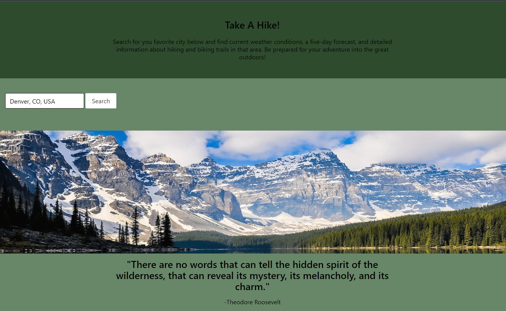
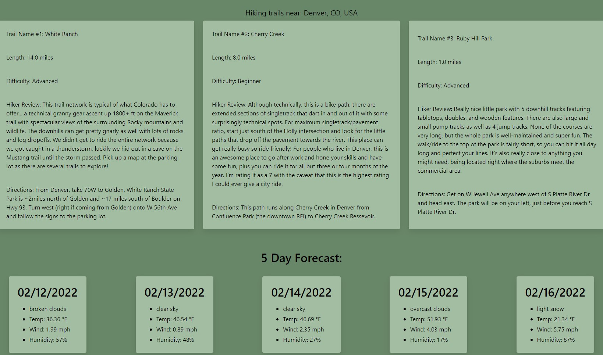

# project-1-DU

Take A Hike!

This interactive wesbite allows fans of the wilderness to input their location by city, state, and country and then returns a list of three prospective trails. The trail information that is presented to the user includes the name, length, difficulty, and general directions to the trail. Each trail that is generated also include a review by a previous hiking or biking enthusiast that has experienced the trail before. The website also generates a five day forecast so that the user can adequately prepared for their adventure into the great outdoors.

Technologies Used:

OpenCage API
Trails API
OpenWeather API

Screenshots:

